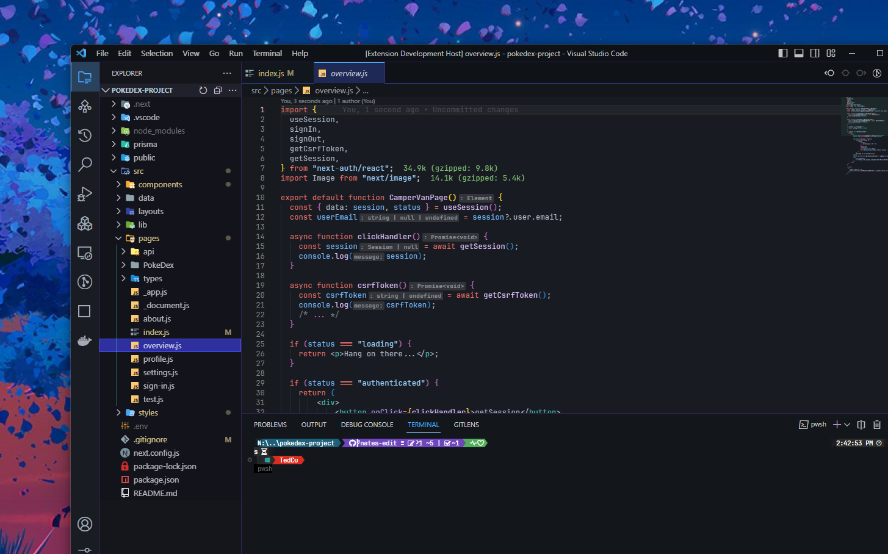

# Custom Github Dark Dimmed Theme

## Installation

1. Open the **Extensions** sidebar in VS Code
2. Search for `Custom Github Dark Dimmed Theme`
3. Click **Install**

## Enable theme

1. Click the gear icon in the lower left corner
2. Click **Color Theme**
3. Select **Custom Github Dark Dimmed Theme**
4. Enjoy! 🎉

## Screenshots

## Override this theme

To override this (or any other) theme in your personal config file, please follow the guide in the [color theme](https://code.visualstudio.com/api/extension-guides/color-theme) documentation. This is handy for small tweaks to the theme without having to fork and maintain your own theme.

## Contribute

1. [Fork](https://github.com/NateAyye/custom-github-dark-theme) this [repo](https://github.com/NateAyye/custom-github-dark-theme) and open it in VS Code
2. Run `npm i` to install the dependencies.
3. Run `git checkout -b <branch-name>` Create a new branch for your changes. (e.g. `feat/new-theme`).
4. Press `F5` to open a new window with your extension loaded (and auto-reload on changes).
5. Open `Code > Preferences > Color Theme` [`⌘k ⌘t`] and pick the "Main Theme / Custom Github Dark Dimmed" theme to test.
6. Make changes to the [`/themes/MyGithubDarkDimmed-color-theme.json`](https://github.com/NateAyye/custom-github-dark-theme/blob/main/themes/MyGithubDarkDimmed-color-theme.json) file. (or create a new one and reference it in [`package.json`](https://github.com/NateAyye/custom-github-dark-theme/blob/main/package.json) under `contributes.themes`)
   - **UI**: For all changes to the "outer UI", like (status bar, file navigation etc.), take a look at the [Theme Color](https://code.visualstudio.com/api/references/theme-color) reference.
   - **Syntax**: For changes to the "code highlighting", examine the syntax scopes by invoking the [`Developer: Inspect Editor Tokens and Scopes`](https://code.visualstudio.com/api/language-extensions/syntax-highlight-guide#scope-inspector) command from the Command Palette (`Ctrl+Shift+P` or `Cmd+Shift+P` on Mac) in the Extension Development Host window.
7. We are using the changesets/cli to manage our changelog and versioning. To create a new version, run `npm run version` and follow the prompts. (will create a new version and changelog once prompts are completed)
   - Select the type of change you're making. (patch, minor, major)
   - Provide a detailed description of your changes.
8. Now you can commit your changes and push them to your forked repo.
9. After you push your changes, you can open a PR to the main repo, and we will review it as soon as possible. 🙌
10. TA-DA! You're done! 🎉

**Enjoy!**
